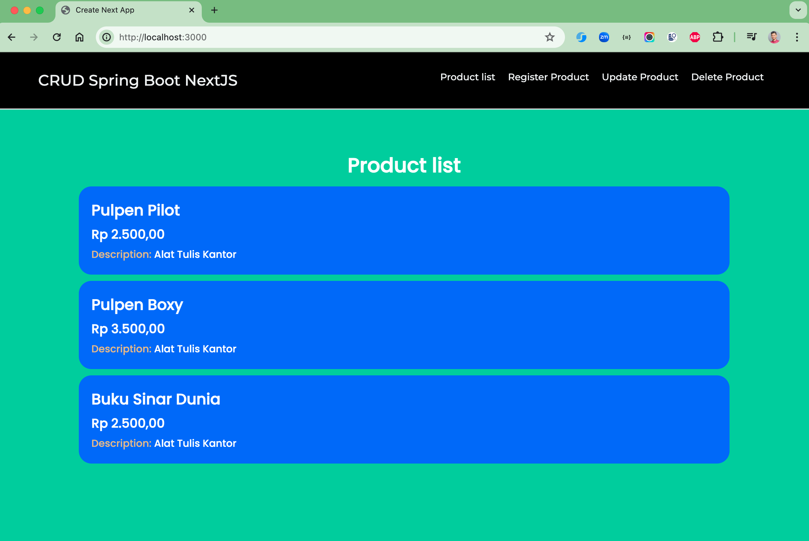
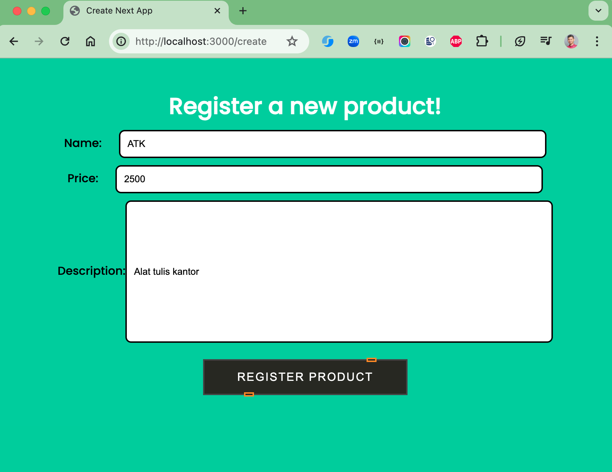
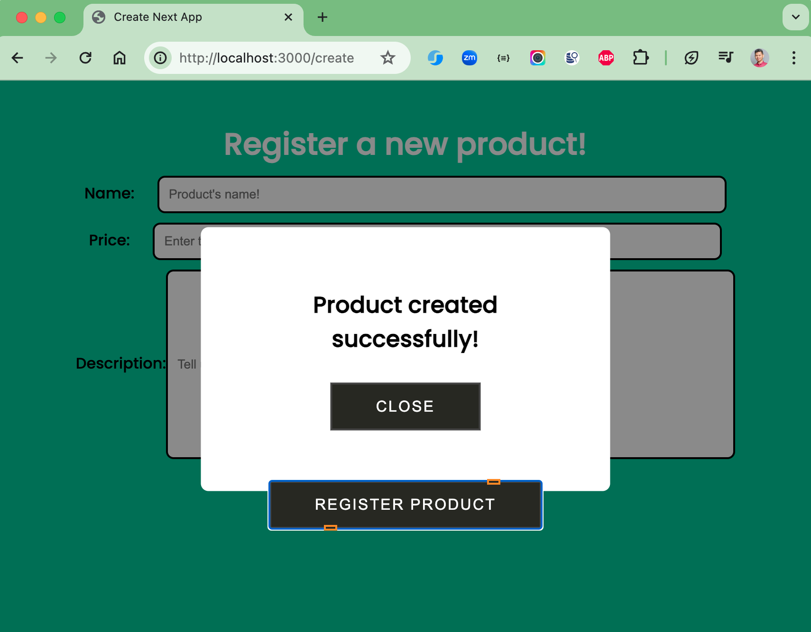
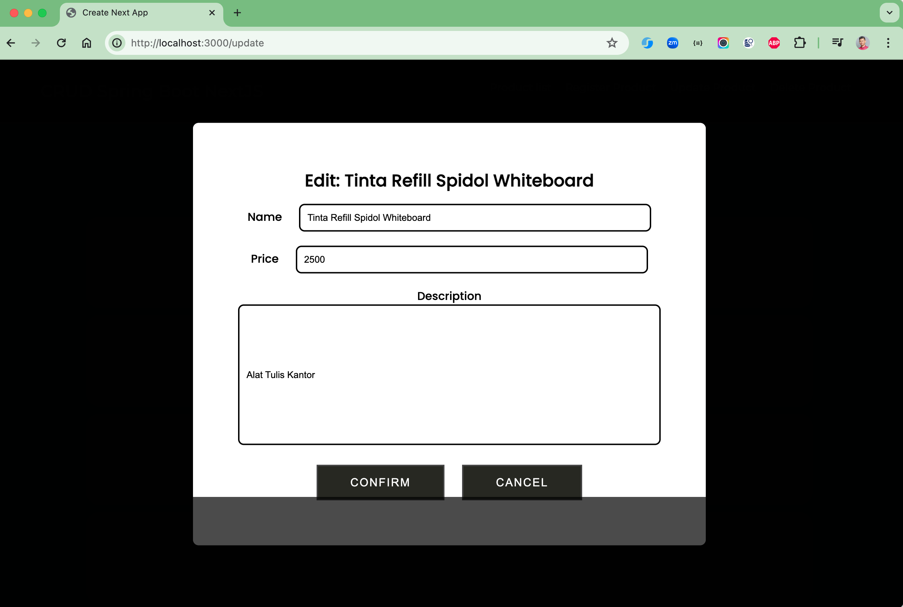
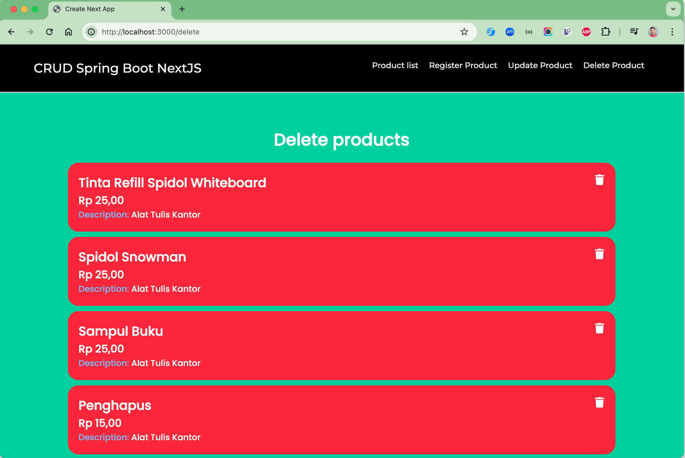

# spring-boot-nextjs-sample2

### Things todo list

1. Clone this repository: `git clone https://github.com/hendisantika/spring-boot-nextjs-sample2.git`
2. Navigate to the folder  `cd spring-boot-nextjs-sample2`
3. Change with your DB credential in `application.properties` file
4. Run Backend service: `./gradlew clean bootRun`
5. Navigate to the folder  `cd spring-boot-nextjs-sample2/frontend`
6. Run web app: `pnpm install && pnpm run dev`
7. Open your favorite browser: http://localhost:3000

### Image Screenshots

Index Page

Add New Product Page

Edit Product Page

Delete Page

